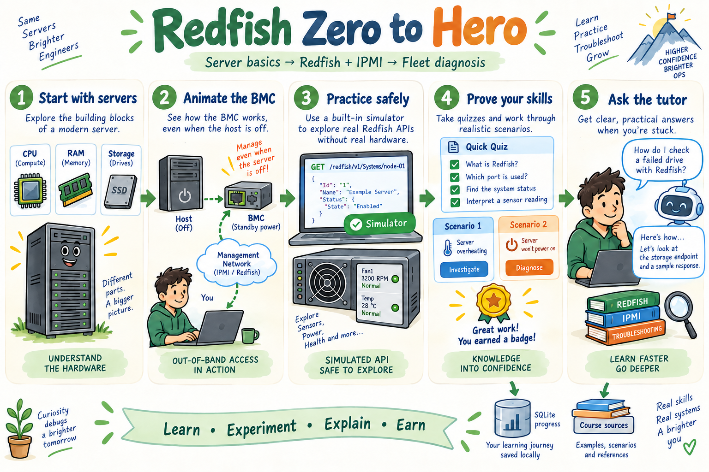
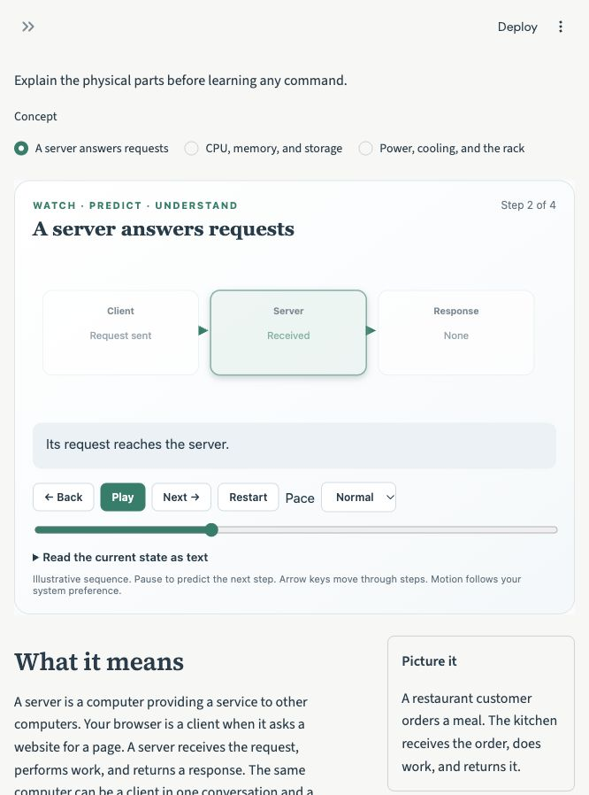
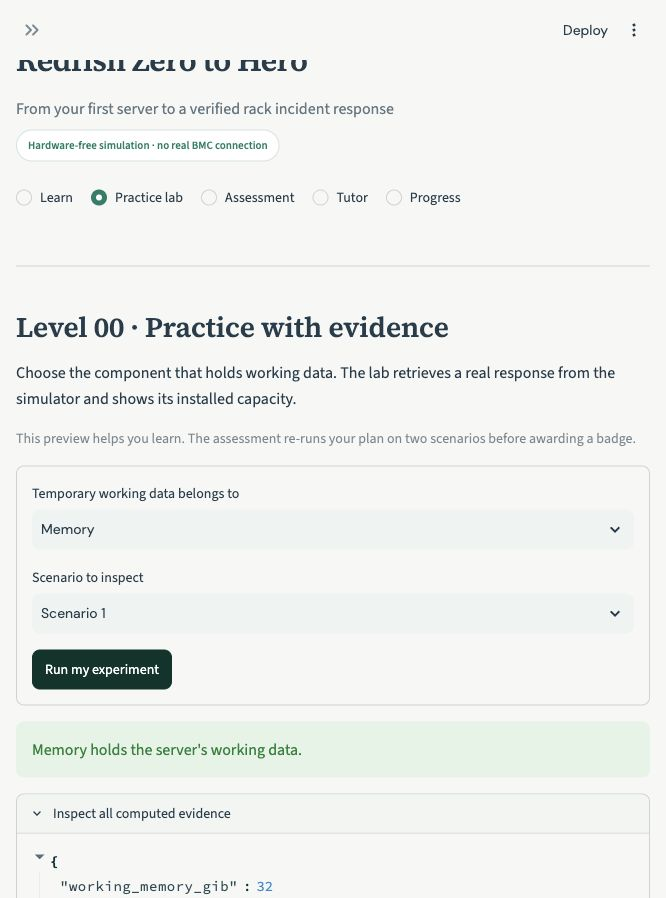
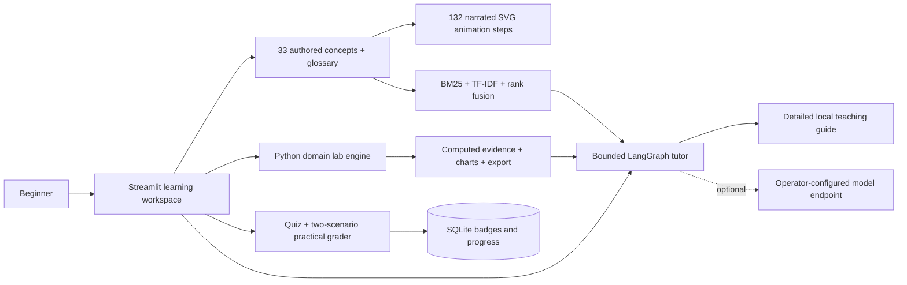

# Redfish Zero to Hero

[](https://github.com/sivalinb/redfish-zero-to-hero/actions/workflows/ci.yml)


Learn the parts of a server, the role of its management controller, JSON and HTTP, then Redfish discovery, inventory, health, events, power, BIOS, firmware tasks, and fleet diagnosis. IPMI comparisons show where sensors, FRU inventory, SEL logs, and power controls fit.

**No prerequisite infrastructure expertise, API key, or GPU purchase is needed to start.** This Python + Streamlit course has 11 levels (0–10), 33 guided concepts, 132 narrated animation steps, 33 practice checks, 55 quiz questions, 11 practical labs, and 11 badges.



*Illustrated teaching overview. The implemented lab boundaries and exact runtime behavior are described below; the drawing is not a screenshot or a hardware capability guarantee.*

## Start in one command

Install Python 3.11, 3.12, or 3.13, then:

```bash
git clone https://github.com/sivalinb/redfish-zero-to-hero.git
cd redfish-zero-to-hero
python3 scripts/bootstrap.py
```

On Windows, use `python` where your installation provides it. The bootstrap creates `.venv`, installs pinned dependencies, and opens a loopback Streamlit server. Visit **[http://127.0.0.1:8521](http://127.0.0.1:8521)**. Stop it with Ctrl+C. First installation needs Internet access to download packages; ordinary lessons and default experiments then run locally.

For an existing environment:

```bash
python -m pip install -r requirements.txt
python -m streamlit run app.py --server.address=127.0.0.1 --server.port=8521
```

## How learning works

1. **Learn:** choose a concept; predict the next frame, then use Play, Pause, Back, Next, speed, or the step slider. Every frame changes the illustrated state and explains what changed. An accessible text view describes the same state.
2. **Understand:** read the plain-language explanation, analogy, worked example, misconception, and glossary. Practice questions explain both correct and incorrect answers.
3. **Experiment:** run a plan, inspect actual computed evidence, and change the scenario. Hints are available without awarding a badge.
4. **Prove it:** score at least 80% on five questions **and** pass your practical plan on both scenario variants. Grading runs in Python; quiz answers or a client-supplied success flag cannot replace the practical check.
5. **Keep progressing:** each completed level earns 100 XP and a badge, then unlocks the next assessment. All lessons remain available to preview. Download your private resume code to reconnect to your locally stored SQLite profile.
6. **Ask:** the tutor retrieves detailed course material with sources. Select a topic before asking “explain this.” Optional model configuration enables conversational generation.




## Level 0 → Level 10

| Level | Topic | What you will learn to do | Badge |
|---|---|---|---|
| 00 | What is a server? | Explain the physical parts before learning any command. | Server Explorer |
| 01 | The management computer inside the server | Separate the host operating system, BMC, management network, and management interface. | Management Navigator |
| 02 | Addresses, requests, and JSON | Read a web API response without assuming prior programming knowledge. | API Reader |
| 03 | Discover the resource map | Navigate advertised links instead of guessing identifiers. | Resource Pathfinder |
| 04 | Inventory with meaningful units | Build an inventory that preserves component meaning, identifiers, and missing information. | Inventory Builder |
| 05 | Health, temperature, power, and fans | Interpret sensor evidence without confusing state, health, units, or absence. | Hardware Observer |
| 06 | Logs, events, and IPMI comparisons | Connect observations to timestamped events and understand what each interface actually provides. | Event Investigator |
| 07 | Power and boot actions | Preview, authorize, execute, and verify supported actions in a simulation. | Careful Operator |
| 08 | BIOS, firmware, and asynchronous work | Distinguish pending intent, running work, and verified completion. | Lifecycle Planner |
| 09 | Python fleet automation | Discover a fleet, bound failures and concurrency, and retain useful results. | Fleet Automator |
| 10 | A rack incident from evidence to recovery | Diagnose the affected layer, choose an appropriate response, and prove the simulated recovery. | Rack Incident Solver |

## What actually executes

A stateful Python simulator exposes a deliberately small Redfish-style API. Reads, demo sessions, roles, confirmations, advertised reset capabilities, pending BIOS changes, asynchronous tasks, and audit records have observable effects. IPMI commands map to the same teaching state; native IPMI transport is not implemented.



The original curriculum lives in `content/course.json`. Official links support further reading; the application does not fetch third-party pages or treat them as instructions. Models have no grading, shell, or equipment-control tool.

## Runnable examples

Activate the environment created by the bootstrap (`source .venv/bin/activate` on macOS/Linux; `.venv\Scripts\Activate.ps1` in Windows PowerShell), then run:

```bash
python -m academy.server --scenario transient
# In another terminal, with the same environment activated:
python -m scripts.redfish_inventory
```

The examples are explained in [the hands-on guide](docs/HANDS_ON.md). Their output should be used to justify an explanation, not only to collect a green check.

## Optional Docker stack

With Docker and Compose installed:

```bash
docker compose up --build -d
# Stop containers without deleting the saved progress volume:
docker compose down
```

The app remains at port 8521. All published host ports bind to `127.0.0.1`. Compose adds a synthetic HTTP training target and an official Prometheus server.
See `compose.yaml` and [the hands-on guide](docs/HANDS_ON.md) for the protocol verification command. This is a local teaching stack; hosted deployments need their own identity, storage, and operational design. Streamlit Cloud can run `app.py`, but local SQLite progress may not survive a recreated host.

## AI course techniques

| Week | Technique | Where it is applied |
|---|---|---|
| 1 | AI-assisted Python app development and visual data exploration | Streamlit, Plotly, evidence tables, interactive SVG sequences |
| 2 | Retrieval and cited answers | Concept-sized chunks, BM25 plus sparse TF-IDF vectors, reciprocal rank fusion, top-three context, source links, unknown-topic response |
| 3 | Stateful agent workflow | LangGraph route → retrieve → inspect → explain → cite; bounded execution and lab-evidence inspection |
| 4 | Evaluation | Versioned 31-case tutor regression set, real protocol tests, practical transfer cases, Streamlit interaction tests, CI |
| 5 | Synthetic data, LoRA, merge, baseline comparison | [Optional question-router workflow](training/README.md), seed-family split, training configs, notebook, measured model evaluator, validated runtime hook |
| 6 | Security and guardrails | No model authority over scores or equipment; input budgets, safe parsers, least-privilege simulation, local endpoints, secret-field scrubbing, profile ownership checks |

TF-IDF is a sparse lexical representation, not a dense semantic embedding model. Default tutor mode is a detailed **authored teaching guide**, not a generative model. Optional LoRA training has not been executed on this development machine; no trained adapter or model-quality gain is claimed.

## Optional conversational tutor

Use an existing operator-managed [Ollama](https://docs.ollama.com/api/chat) model server, then set:

```bash
TUTOR_OLLAMA_URL=http://127.0.0.1:11434 TUTOR_MODEL=YOUR_INSTALLED_MODEL python -m streamlit run app.py --server.address=127.0.0.1 --server.port=8521
```

The app sends the question, retrieved course context, and bounded redacted lab evidence to that configured endpoint. HTTP is limited to loopback or the documented container hostname; remote endpoints require HTTPS. If the model is unavailable, the authored guide remains usable. Generated explanations still require scrutiny; citation presence alone does not prove faithfulness.

## Validation and the beginner review

```bash
python -m pip install -r requirements-dev.txt
ruff check .
pytest -q
python -m scripts.evaluate_tutor --check
python -m training.prepare
```

[Measured tutor results](docs/tutor-evaluation.json), [validation evidence](docs/VALIDATION.md), and [the fresh-graduate persona review](docs/GRADUATE_REVIEW.md) make the limits reviewable. The reviewer checks whether each skill can be explained and transferred rather than treating badges as expertise. Try the [independent capstone](docs/INDEPENDENT_CAPSTONE.md) without copying a worked plan.

**Scope:** The simulator is not a Redfish conformance implementation, vendor emulator, firmware installer, or hardware repair tool. Its Thermal representation is a teaching example; newer platforms may expose newer subsystem resources. `/training/` maintenance routes and message IDs are our own teaching fixtures. Task progress advances on reads. IPMI is a bounded comparison parser, not `ipmitool` execution.

**Next supervised practice:** Read a DMTF mockup or a supervised vendor BMC using its current documentation. Compare advertised links, schema versions, allowed ResetTypes, BIOS apply times, task messages, TLS, sessions, and event delivery. Practice real writes only in an appropriate lab and maintenance process.

## Sources and related courses

- [DMTF Redfish developer resources](https://redfish.dmtf.org/)
- [Redfish resource and schema guide](https://redfish.dmtf.org/schemas/v1/DSP2046_2025.3.pdf)
- [IPMI promoters' specification statement](https://www.intel.com/content/www/us/en/products/docs/servers/ipmi/ipmi-home.html)

Continue across the infrastructure learning path: [SPL](https://github.com/sivalinb/spl-zero-to-hero), [PromQL](https://github.com/sivalinb/promql-zero-to-hero), [Redfish + IPMI](https://github.com/sivalinb/redfish-zero-to-hero), [OpenTelemetry](https://github.com/sivalinb/opentelemetry-zero-to-hero), and [GPU infrastructure](https://github.com/sivalinb/gpu-infrastructure-zero-to-hero).

Illustration generation prompts are preserved in `docs/assets/architecture-prompt.txt` and `architecture-revision-prompt.txt`. Original lesson prose and code are MIT licensed; linked specifications and product documentation retain their own terms.
